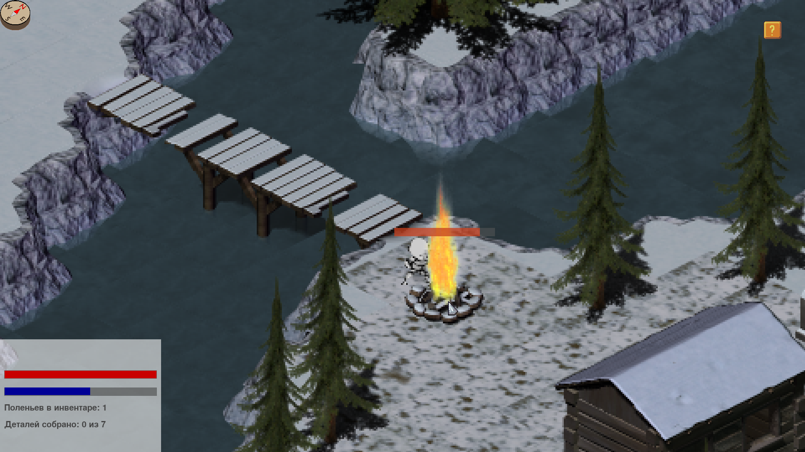
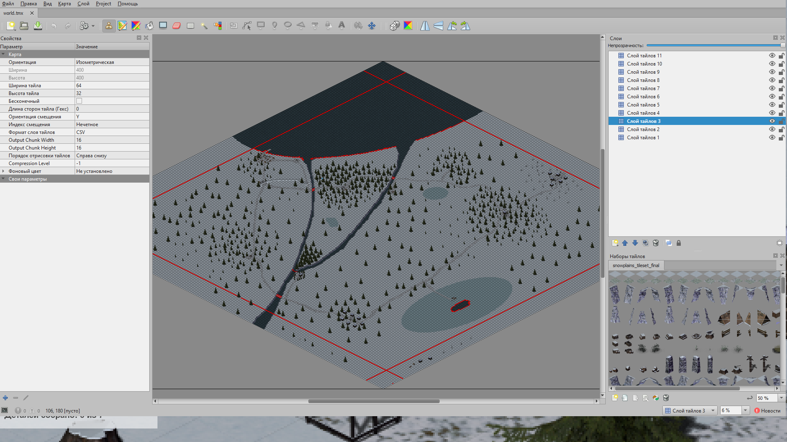
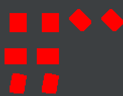
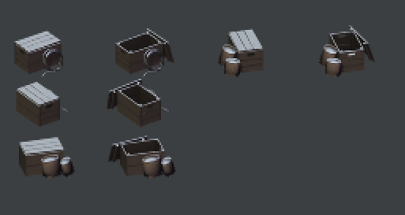

# The long way

The long way - игра-бродилка с изометрической графикой.

## Описание реализации

### Модули
 - Constants - константы, и функции, которые используются в других модулях. Например: размер тайла, частота обновлений кадров, перевод координат из декартовой системы в изометрическую.
 - Entity - динамические объекты игры: сундук, огонь, охапка дров и сам персонаж игры.
 - GuiElements - окно, отображающее показатели персонажа: шкалу здоровья и холода, инвентарь.
 - InfoWindow - окно с текстом и кнопкой закрытия.
 - main - тут происходит инициализация игры.
 - Map2 - клетчатое поле. Содержит в себе методы отрисовки; обновления; проверки столкновений; движения камеры; определения клетки, на которое было совершено нажатие.
 - MapLoader - парсер xml файла карты игры.
 - MenuElements - элементы графического интерфейса: рамки и кнопки.
 - StartMenu - запуск начального меню игры.
 

### Клетчатое поле
Карта игры создана при помощи tiled map editor и хранится в виде xml файла. На данный момент есть одна карта размерами 400 x 400 тайлов.

### Главный герой
Главный герой может двигаться в 8 сторон. Движения сопровождаются соответствующими анимациями. У персонажа есть две шкалы - шкала тепла и здоровья. При нахождении рядом с горящим костром тепло прибавляется, иначе убывает. Если шкала тепла на нуле, начинает тратиться уровень здоровья. Если здоровье становится равным нулю - игра заканчивается и происходит переход на стартовое меню.

### Динамические объекты.
В игре есть три динамических тайла: сундуки, костры и охапка дров.
 - При нажатии на сундук в инвентарь добавляется одна деталь.
 - При нажатии на костер, при наличии в инвентаре дров, к костру прибавляется время горения.
 - Нажатие на охапку дров добавляет в инвентарь одно полено (Дров можно брать сколько угодно)
 
### Столкновения
Для обработки столкновений была создана дополнительная текстура коллизий, в которой красным цветом обозначены непроходимые области тайлов. Каждому тайлу соответствует свой коллайдер.

Пример текстур и соответствующий коллайдеров
 

В разделе "Клетчатое поле" на скришноте красным цветом покрашены блоки-барьеры: непроходимые блоки, невидимые в игре.
 
### Цель игры
Игроку нужно собрать 7 деталей в разных локациях следуя инструкции, данной в начале. Во время прохождения нужно поддерживать уровни тепла и здоровья, греясь у костров, расположенных на ключевых(и не только) локациях игры. В конце следует найти лодку, чтобы уплыть с острова.

### Управление
 - Движение: W, A, S, D.
 - Взаимодействие с элементами меню и игровыми объектами: Левая кнопка мыши.
 - Показать процесс отрисовки - H
