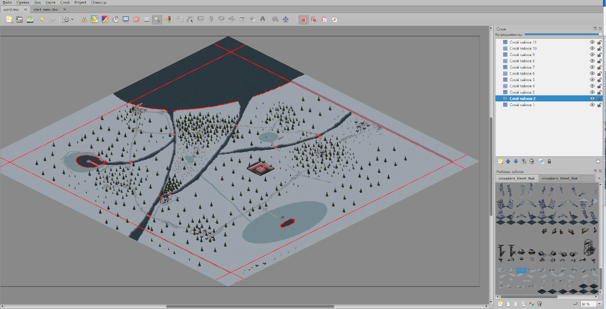

# The long way

The long way - игра-бродилка с изометрической графикой.

## Описание реализации

### Модули
 - Constants - константы и функции, которые используются в других модулях. Например: размер тайла, частота обновлений кадров, перевод координат из декартовой системы в изометрическую и наоборот.
 - Entity - динамические объекты игры: сундук, огонь, охапка дров и сам персонаж игры.
 - GuiElements - окно, отображающее показатели персонажа: шкалу здоровья и холода, инвентарь.
 - InfoWindow - окно с подсказками для игрока и кнопкой закрытия.
 - main - тут происходит инициализация игры.
 - Map2 - клетчатое поле. Содержит в себе методы отрисовки, обновления, проверки столкновений, движения камеры и определения клетки, на которое было совершено нажатие.
 - MapLoader - парсер xml файла карты игры.
 - MenuElements - элементы графического интерфейса: рамки и кнопки.
 - StartMenu - запуск начального меню игры.
 

### Клетчатое поле
Карта игры создана при помощи tiled map editor и хранится в виде xml файла. На данный момент есть одна карта размерами 400 x 400 тайлов.

### Главный герой
Главный герой — скелет — может двигаться в 8 сторон. Все передвижения главного героя сопровождаются анимациями. У персонажа есть две шкалы — тепла и здоровья. Если игрок находится достаточно близко к горящему костру, его школа тепла заполняется, в противном случае, шкала стремится к нулю. Когда шкала тепла на нуле, начинает тратиться уровень здоровья. Если шкала здоровья полностью обнуляется — игра заканчивается и происходит запуск начального меню игры.

### Динамические объекты
В игре есть три динамических тайла: сундуки, костры и охапка дров.
 - При нажатии на сундук в инвентарь добавляется одна деталь.
 - При нажатии на костер, при наличии в инвентаре дров, к костру прибавляется время горения.
 - При нажатии на охапку дров в инвентарь добавляется одно полено (дров можно брать сколько угодно).
 
### Столкновения
Для обработки столкновений была создана дополнительная текстура коллизий, в которой красным цветом обозначены непроходимые области тайлов. Каждому тайлу соответствует свой коллайдер.

Пример текстур и соответствующих коллайдеров

 

В разделе "Клетчатое поле" на скришноте красным цветом покрашены блоки-барьеры: непроходимые блоки, невидимые в игре.

## 
Все расчеты (такие как нахождение расстояний, обработка столкновений, движение) производятся в декартовой системе координат, то есть на клетчатом поле. Перевод в изометрическую систему происходит только при отрисовке кадра.
 
## Цель игры
Игроку нужно собрать 7 деталей в разных локациях следуя инструкции, данной в начале. Во время прохождения нужно поддерживать уровни тепла и здоровья, греясь у костров, расположенных на ключевых(и не только) локациях игры(костры нужно сначала разжечь). В конце следует найти лодку, чтобы уплыть с острова.

## Управление
 - Движение: W, A, S, D.
 - Взаимодействие с элементами меню и игровыми объектами: Левая кнопка мыши.
 - Показать процесс отрисовки - H
 
## Видео
 - Отрисовка тайлов https://youtu.be/Sh37CCVHXPs
 - Полное прохождение https://www.youtube.com/watch?v=tRM5wLpsGcY
