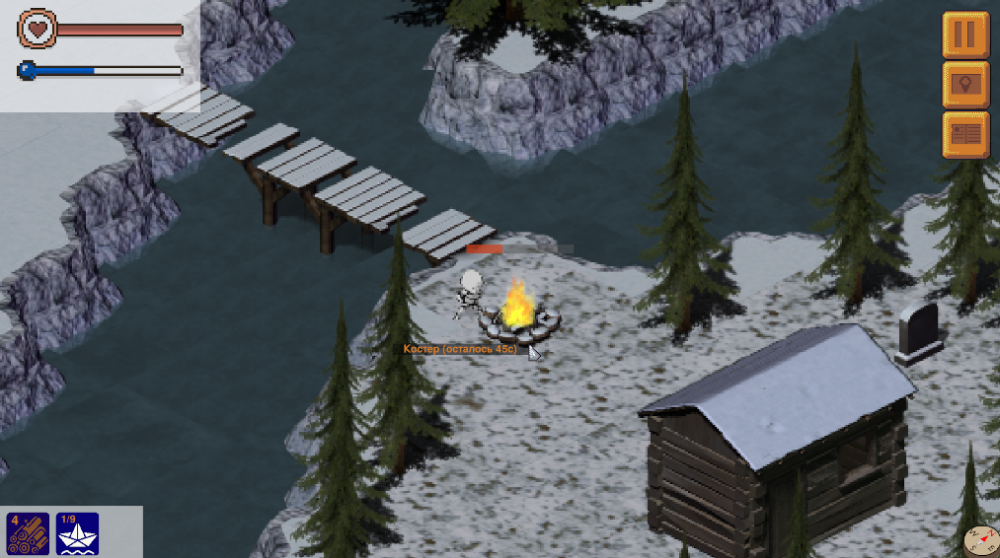

# The long way

The long way - игра-бродилка с изометрической графикой.

## Описание реализации

### Модули
 - Constants - основные константы и функци, такие как размер тайла, частота обновлений кадров, перевод координат из декартовой системы в изометрическую и наоборот.
 - Entity - Игровые объекты: сундук, огонь, охапка дров и сам персонаж игры.
 - GuiElements - Показатели игрока, инвентарь, кнопки, рамки.
 - MapBase - основной класс карты. Реализует отрисовку, обработку нажатий по клеткам, обработку столкновений.
 - MainMap - главная игровая карта.
 - MenuMap - карта, отображающаяся в главном меню.
 - StartMenu - графический интерфейс главного меню.
 - MapLoader - загрузка карты из xml файла.
 - MapWindow - окно с картой игры.
 - TextWindow - окно с текстом.

 

### Клетчатое поле
Карта игры создана при помощи tiled map editor и хранится в виде xml файла. На данный момент есть одна карта размерами 400 x 400 тайлов.
Отрисовка происходит послойно начиная с нижних слоев. Каждый слой отрисовывается начиная с дальних клеток. Таким образом ближние объекты перекрывают дальние это создает эффект трехмерности. Процесс отрисовки можно отобразить нажатием кнопки h

На скришноте красным цветом покрашены блоки-барьеры: непроходимые блоки, невидимые в игре.

### Главный герой
Главный герой — скелет — может двигаться в 8 сторон. Все передвижения главного героя сопровождаются анимациями. У персонажа есть показатели тепла и здоровья. Шкала тепла заполняется вблизи костра и убывает в других случаях. Здоровье начинает тратиться при нулевом показателе шкалы тепла. Игра заканчивается при исчерпании показателя здоровья.

### Игровые объекты
 - При нажатии на ящик в инвентарь добавляется одна деталь.
 - При нажатии на костер, при наличии в инвентаре дров, к костру прибавляется время горения.
 - При нажатии на охапку дров в инвентарь добавляется одно полено (в одной охапке дров неограниченное количество).
 
### Столкновения
Для обработки столкновений была создана дополнительная текстура столкновений(data/images/Colliders.png), в которой красным цветом обозначены непроходимые области тайлов. Каждому тайлу соответствует свой коллайдер.

Часть текстуры столкновений

## Звуки и музыка
Во время игры циклически проигрывается фоновая музыка. В игре есть звуки костра, ходьбы, ветра, открытия ящиков, взятия предметов и другие.

## Цель игры
Игроку нужно собрать 9 деталей расположенных в разных локациях следуя карте. Во время прохождения нужно поддерживать уровни тепла и здоровья, греясь у костров(костры нужно сначала разжечь). В конце следует найти лодку, чтобы уплыть с острова. На карте обозначены тропы, мосты, реки, примерные расположения костров и охапок дров.

## 
Все расчеты (такие как нахождение расстояний, обработка столкновений, движение) производятся в декартовой системе координат, то есть на квадратном клетчатом поле. Перевод в изометрическую систему происходит только при отрисовке кадра. Перевод из изометрической системы изпользуется при обработке нажатий.
 

## Управление
 - Движение: W, A, S, D.
 - Взаимодействие с элементами меню и игровыми объектами: Левая кнопка мыши.
 - Показать процесс отрисовки - H

## Как запустить
 - Первый способ - распаковать архив и запустить main.exe
 - Второй способ - установить зависимости из requirements.txt и запустить main.py
